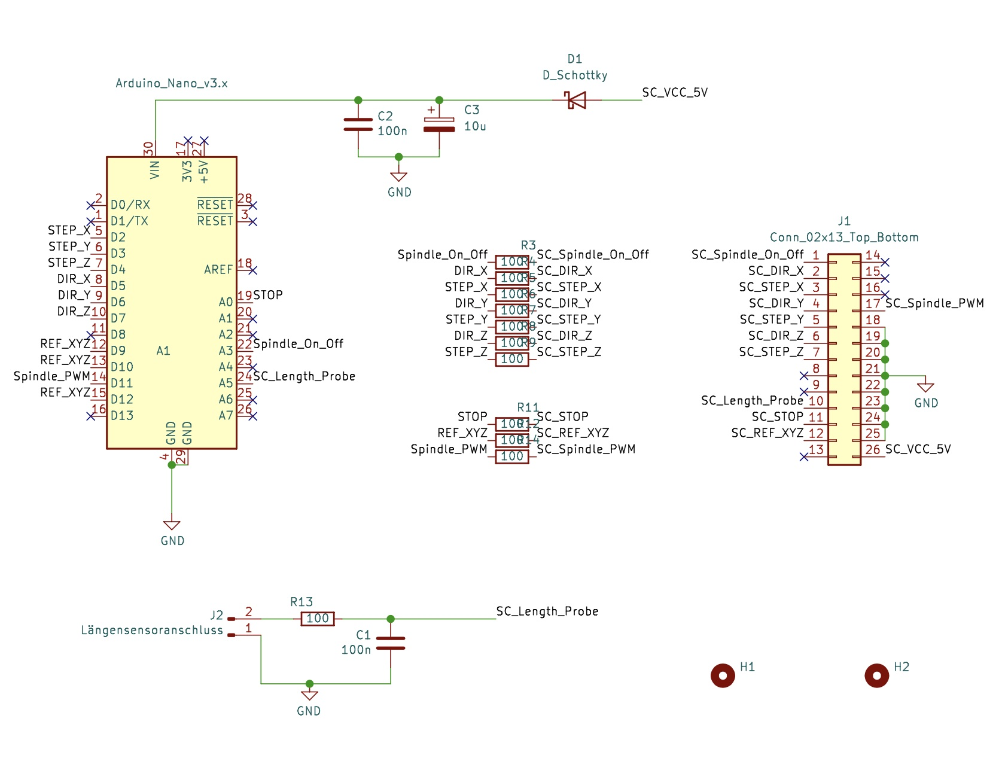

# nanoGRBLizer
nanoGRBLizer is a GRBL 1.1 based Arduino Nano controller for Stepcraft SC420 D2 milling machine.
The design is based on the well known GRBLizer controller specifically designed for the Stepcraft mills by Rogier Lodewijks (see https://github.com/eflukx/Stepcraft-GRBLizer). 
The nanoGRBLizer controller uses the open source GRBL1.1h software (https://github.com/gnea/grbl/wiki) and allows in combination with a GRBL code sender (eg. UltimateCNC or UGS) controll of all 3 axes and the spindle of the stepcraft mill. A probe length sens input is also available. 

The functionality of the nanoGRBLizer compared to the original GRBLizer lacks the connections to controll a 4th axis and additional relais. Dimensions and functionalty of the nanoGRBLizer PCB allow for a 1:1 replacement of the WinPCNC USB controller of the Stepcraft mills, which is often used for hobby purposes.



I first tried the original GRBLizer and ordered a PCB by PCBWay but realized that getting the required parts was problematic and costly. I therefore reduced the original design to the functionalities I really needed and had a specific focus on simplicity and cost. As a result I designed the nanoGRBLizer around a Arduino Nano bord which reduced the complexity a lot and was also very cost efficient. 

This repository holds the KiCAD files to replicate the nanoGRBLizer and gives hints for implementation, configuration and initial operation of the nanoGRBLizer.

## PCB Assembly
There are some caveeats which have to be respected during assembly of the PCB due to the space constraints of the Stepcraft mill.
- First the 6 pin ISP header of the Arduino Nano has to be shorted by about 3mm. Alternatively you have to unsolder the header or insolate it, as the metal shield of the Stepcraft driver board might shorten the pins.
- Directly solder the Arduino Nano on the PCB. Do **not use a socket** as the PCB might not fit into the available space and the USB socket might not be usable.

## Installation of GRBL1.1 firmware
- Download the current version of the GRBL 1.1 software from here: https://github.com/gnea/grbl
- Install the grbl lib according to your Arduino IDE
- Implement the changes to the files cpu_map.h and config.h as described in the next section
- Compile the grbl_uload.ino script from the grbl examples and download to your Nano

## Configuration of Controller
I implemented the grbl settings as described by Rogier in his readme. They did not quite worked for me, but were a very good starting point. 
As I wanted to use the HF500 spindle with my SC420 mill I had to figure out how to get the spindle enable signal on A3 working.
I changed the config.h, the cpu_map.h and the defaults.h file to reflect the changes needed by my configuration. To avoid chnaging configuration settings inside the default configuration for Atmega328 microprocessor I decided to redefine required symbols inside a conditional block directly below the default settings. This redefinitions are guarded by a `#ifdef NANO_GRBLIZER ... #endif` bracket. The symbol NANO_GRBLIZER was then definded in config.h as shown below:
```
// Define CPU pin map and default settings.
// NOTE: OEMs can avoid the need to maintain/update the defaults.h and cpu_map.h files and use only
// one configuration file by placing their specific defaults and pin map at the bottom of this file.
// If doing so, simply comment out these two defines and see instructions below.
#define DEFAULTS_GENERIC
#define CPU_MAP_ATMEGA328P // Arduino Uno CPU
#define NANO_GRBLIZER       // triggers redefinitions in config.h, cpu_map.h and defaults.h for nanoGRBLizer
```
Now add the following code snippet to config.h at the **end of the file**:

```
#ifdef NANO_GRBLIZER

// Paste config redefinitions for nanoGRBLIzer  here:

// do not raise alarm to force initial homing at startup
#undef HOMING_INIT_LOCK // Comment to disable

// Since all limit switches end up being shared on one pin, 
// we can only home one direction at a time.
#define HOMING_CYCLE_0 (1<<Z_AXIS)  // REQUIRED: First move Z to clear workspace.
#define HOMING_CYCLE_1 (1<<Y_AXIS)  // OPTIONAL: Then move X,Y at the same time.
#define HOMING_CYCLE_2 (1<<X_AXIS)  // OPTIONAL: Uncomment and add axes mask to enable

// The stop output of the Stepcraft board is inverted to what GRBL expects.
// However you simply can't swap the switch because the driver board will also
// disable the motors so nothing will move.
#define INVERT_CONTROL_PIN_MASK (1<<CONTROL_RESET_BIT) // Default disabled.

// use safety door open event to stop mill and spindle with emergency stop switch
#define ENABLE_SAFETY_DOOR_INPUT_PIN // Default disabled. Uncomment to enable.

// Allows operation of Stepcraft HF500 spindle via grbl
// Activates definition of spindle on/off signal
#define USE_SPINDLE_DIR_AS_ENABLE_PIN

#endif
```

Now lets change the cpu_map.h file for nanGRBLizer. Past the following code directly below the CPU_MAP_ATMEGA328P definitions into the file.

```
#ifdef NANO_GRBLIZER

// Paste cpu_map.h redefinitions for nanoGRBLizer here.

/* Additional or changed Grbl cpu mappings for nanoGRBLizer v01 with Arduini Nano
   Mill:      Stepcraft sc420 D2
   Spindle:   Stepcraft HF500
*/


// The Stepcraft has all limits on one pin.
#define X_LIMIT_BIT    1  // Uno Digital Pin 9
#define Y_LIMIT_BIT    1  // Uno Digital Pin 9
#define Z_LIMIT_BIT    1  // Uno Digital Pin 9


// redefinition of coolant enable port to save A3 for spindle
#define COOLANT_FLOOD_BIT   6  // Uno Analog Pin 3

// redefinition of safty door bit to be shared with CONTROL_RESET_BIT
// hope this will shutsdown spindle and mill when triggered by E-Stop 
#define CONTROL_SAFETY_DOOR_BIT   0

// redefinition of spindle enable port 
// needs definition of USE_SPINDLE_DIR_AS_ENABLE_PIN in config.h 
// to allow for seperate spindle on/off signal via A3
#define SPINDLE_ENABLE_DDR    DDRC
#define SPINDLE_ENABLE_PORT   PORTC
#define SPINDLE_ENABLE_BIT    3  // Uno Analog Pin 3


#endif //  NANO_GRBLIZER
```

Add the changes to the default parameter definition. Past the following section directly below the `DEFAULTS_GENERIC` block.

```
#ifdef NANO_GRBLIZER

  // Paste changes to generic default settings for nanoGRBLizer with sc420 and HF500 here.

  // My old version of Stepcraft sc420 has spindles with 2mm travel per revolution!
  // At 400 half steps per revolution this leads to 200.000 half steps per millimeter
  // whereas the newer versions have spindles with 3mm travel per revolution, hence
  // 133.333 half steps per mm travel!

  #define DEFAULT_X_STEPS_PER_MM 200.000		// standard will be 133.333
  #define DEFAULT_Y_STEPS_PER_MM 200.000		// standard will be 133.333
  #define DEFAULT_Z_STEPS_PER_MM 200.000		// standard will be 133.333
  #define DEFAULT_X_MAX_RATE 800.0 // mm/min
  #define DEFAULT_Y_MAX_RATE 800.0 // mm/min
  #define DEFAULT_Z_MAX_RATE 800.0 // mm/min
  #define DEFAULT_X_MAX_TRAVEL 300.0 // mm NOTE: Must be a positive value.
  #define DEFAULT_Y_MAX_TRAVEL 420.0 // mm NOTE: Must be a positive value.
  #define DEFAULT_Z_MAX_TRAVEL 80.0 // mm NOTE: Must be a positive value.
  #define DEFAULT_SPINDLE_RPM_MAX 20000.0 // rpm
  #define DEFAULT_SPINDLE_RPM_MIN 3000.0 // rpm
  #define DEFAULT_STEP_PULSE_MICROSECONDS 50
  #define DEFAULT_STEPPER_IDLE_LOCK_TIME 100 // msec (0-254, 255 keeps steppers enabled)
  #define DEFAULT_INVERT_ST_ENABLE 1 // false
  #define DEFAULT_INVERT_LIMIT_PINS 1 // false
  #define DEFAULT_SOFT_LIMIT_ENABLE 0 // false
  #define DEFAULT_HARD_LIMIT_ENABLE 1  // false
  #define DEFAULT_INVERT_PROBE_PIN 0 // false
  #define DEFAULT_HOMING_ENABLE 1  // false
  #define DEFAULT_HOMING_DIR_MASK 1 // move x to left to find limit switch
  #define DEFAULT_HOMING_FEED_RATE 120.0 // mm/min
  #define DEFAULT_HOMING_SEEK_RATE 900.0 // mm/min
  #define DEFAULT_HOMING_DEBOUNCE_DELAY 250 // msec (0-65k)
  #define DEFAULT_HOMING_PULLOFF 1.0 // mm

#endif
```

## Initial Operation with UltimateCNC and nanoGRBLizer V1.0
I used UltimateCNC on Linux as a gcode sender and after initial connection to the nanoGRBLizer a error alarm showed up, which confused me a lot. After a few hours of debugging and head scratching I found the solution in the config.h file of the grbl library. I just disabled the HOMING_INIT_LOCK and could proceed. Homing and moving of all axes was fine, but I had a problem with the z-probing. I connected a simple probe at the probe connector of the nanGRBLizer and tried probing. I had to hit the stop switch as the bit did not stop at contact with my metal sheet. 

Measurements showed that the voltage between both pins of the probe dropped from about 5V to OV but the probe event was not triggered. Testing outside the SC420 showed normal behaviour, eg. a probe event was recognized without problems. So the problem has to be the combination of nanoGRBLizer and SC420. After I connected the probe directly to the probe connector on the stepcraft mainboard everything worked as expected! Well now I understand the optional jumper to break the connection between A5 and SC_Length in the original GRBLizer schematic.

There was just one additional change I had to make to the UltimateCNC default probe macro. The probe connected to the metal sheet and immediatldiatly raised an alarm. A closer look at the probe macro showed that after initial contact an additional G38.2 command was issued without raising the spindle.
I changed that to `G38.2 Z-50 F50; G92 Z0; G0 Z10` as a first fix and all was fine.

Further testing showed that all 3 axes did not travel the required distances. After some test and head scratching I figured out (sometimes its worth looking into the manual) that my early type of SC420 has spindles with 2mm travel distance per revolution and 200 steps per revolution stepper motors. As the Stepcraft drivers work in half step mode we have 400 half steps per revolution. After adjusting the (half) steps per mm travel to 200.000 for all axes ($100, $101 and $102) everything worked as expected.

So if you try to use this controller I hope the information above will help you. Have fun!


IMPORTANT NOTE  - Changes to nanoGRBLizer Rev 1.1

When I tried to use AutoLevelling in UGS/UltimatCNC I discovered a very strange behavior. After initial x axis zero AutoLevellimng could bestartet but stopped at firs probe position with an error (incompatible initial state for probing). After some tests I found the reason to be the probe connected to the Stepcraft mainboard.
After I interrupted the connection to  J1 pin 10 (Stepcraft probe sense connection) and connected the probe to J1 on the nanoGRBLizer controller everything worked as expected.

These changes to the schematic and the board layout are reflected in the nanoGRBLizer Rev 1.1


In Addition I included the files for grbl V1.1h with all SC 420 D2 related changes to the config.g, cpu_map.h and defaults.h files. So just compile and upload grblUpload.ino and you are done. All relevant settings for Stepcraft SC 420 D2 are included in the code.


